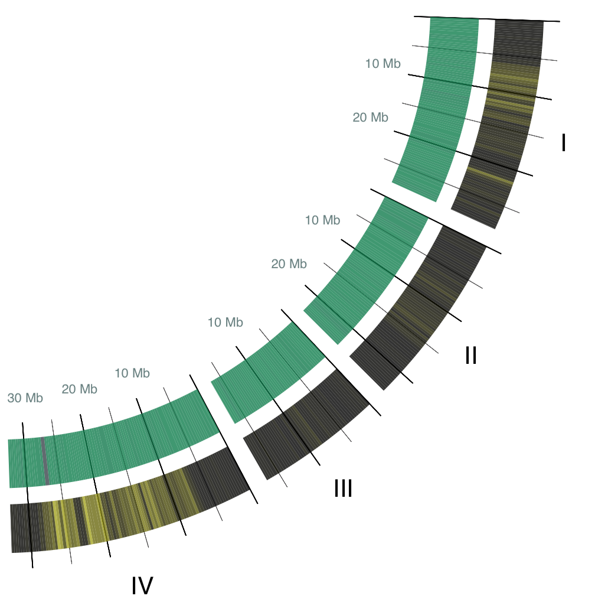
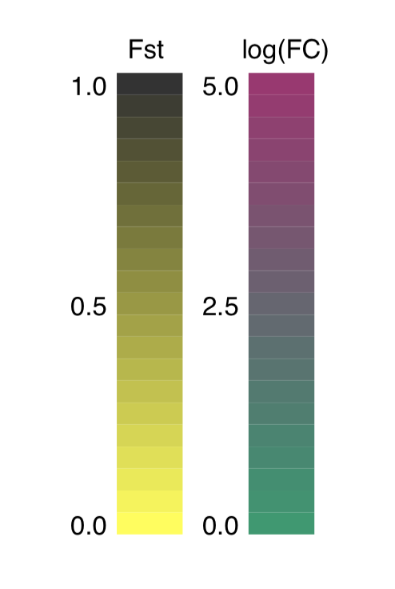
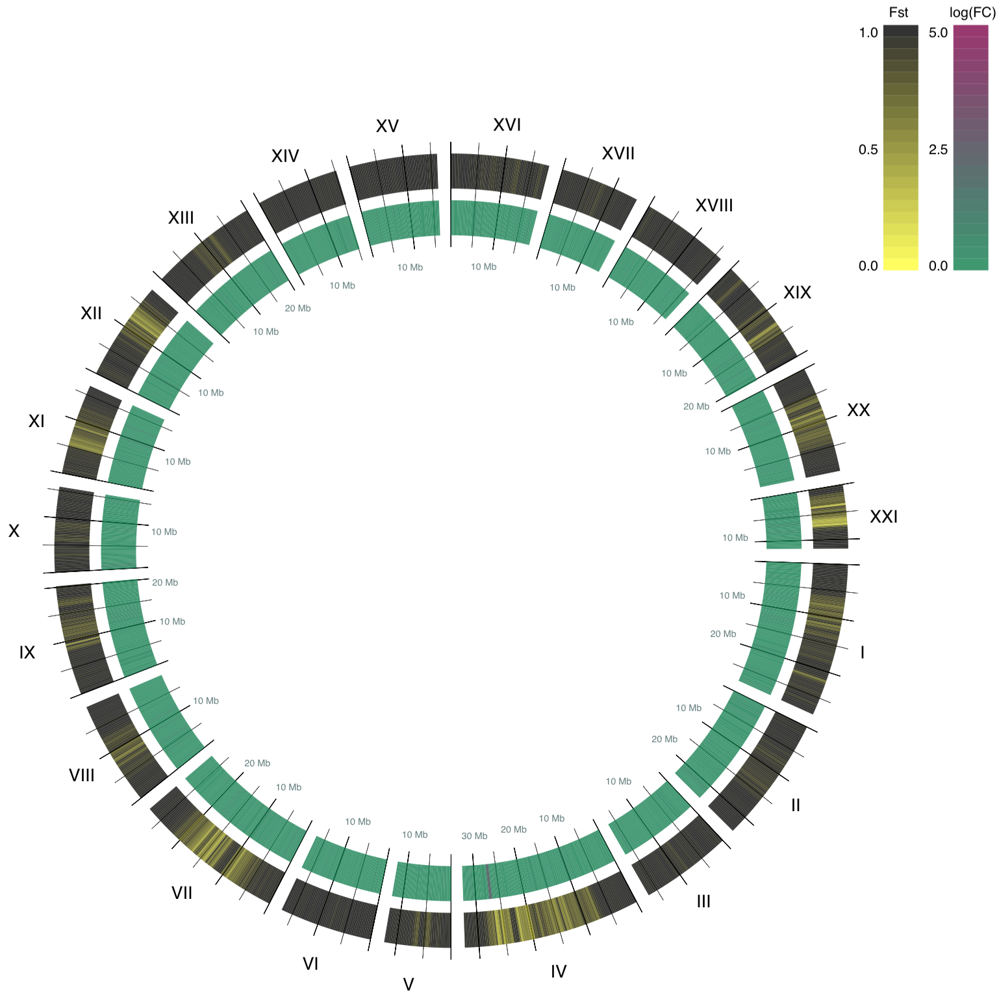

> <!DOCTYPE html>
> <html>
>   <head>

Also, add this to your site's common HTML template, inside the `<head>`:

    <meta charset="utf8" />

>     <title>
>       Jeena Lee
>     </title>
>     <link rel="stylesheet" type="text/css" href="../theme.css"></link>
>   </head>
>   <body>
>     <header>
>       <h1><a href="../index.html">Jeena Lee</a></h1>
>       <ul>
>         <li><a href="../contact.html">contact</a></li>
>         <li class="current"><a href="../blog.html">blog</a></li>
>       </ul>
>     </header>
>
>     <section class="blog_intro">
>       
<a href="../blog.html">..back to list of entries</a>

Personally, I would get rid of this link, and do the sticky/fixed
header that we talked about the other day instead. The link to "blog"
in the header should be enough backwards navigation.

>
>       <h1 class="blog_title">Drawing Circle Plot with Python</h1>
>     </section>
>     

>        In Summer 2015, I started working towards earning a Master's
>        degree in Bioinformatics at University of Oregon. The first
>        quarter of the program was more or less a programming bootcamp
>        with some biology sprinkled in; we started off with
>        command-line, then UNIX, then Python, and so on. The last
>        assignment for the class was to create a circle plot using
>        Python, which I will write about today. The link to my code on

As a reader interested in drawing circle plots with Python and
understanding some gene expression stuff, whether or not you did this
for a class doesn't seem relevant to me.

>        GitHub is <a href="https://gist.github.com/jeenalee/ff0b478396bff32a2804">here</a>.

I would put this in a "normal" github repo, not a gist.

>        

>     <h2>The Data</h2>
>     

>        In order to talk about circle plot, let's first talk

"about *the* cicle plot" or "about circle plot*s*"

>        about the data used for making the plot. The data I used is the
>        gene expression profiles
>        of <a href="https://en.wikipedia.org/wiki/Three-spined_stickleback">three-spined
>        stickleback</a>.

I would re-word this like: "I'm plotting gene expression profiles of
the three-spined stickleback." It sounds a little awkward written
as-is.

>        Three-spined stickleback is often a popular

"*The* three-spined stickleback..."

>        choice of model organism for studying population genetics,

Lets make this sentence less passive and remove qualifiers that weaken
the statement, such as "often", since it is already a subjective
statement:

"The three-spined stickleback is a popular model organism for studying
population genetics, ..."

>        because they are the fish version of Darwin's finches -- they

Snip this run-on sentence in the bud:

"... Darwin's finches*.* They..."

>        have a wide range of morphology, easy to keep in lab and find

"... *are* easy to keep in lab and find in nature, ..."

>        in nature, and most importantly for this blog post, they can
>        tolerate salinity very well. In other words, they can be found
>        in both fresh water and ocean water.

Generally, you don't want to write things like "they can do this",
"can be *verb*", or "they are *verb*" because it sounds very
non-committal and passive. Instead, actively use the verb: "they
*verb*".

"They can be found" -> "we find them", except that sounds weird
because it places the focus on "us" which was implicit in the previous
form. To place the focus back on them, use "they (survive in/thrive
in/live in/inhabit) both fresh water and ocean water."

I like this variant: "... and most importantly, they thrive in both
fresh water and ocean water".

>        The data I used is the
>        RNA-sequencing data from two three-spined stickleback

"I used/analyzed/plotted RNA-sequencing data from ..."

>        populations, one from fresh water and another from ocean water.
>          

Don't use ` ` tags: instead split this into two separate `
`
paragraphs.

> For visualizing the data, I focused on two

"*When* visualizing the data, ..."

>        things: <a href="https://en.wikipedia.org/wiki/F-statistics">F-statistics</a>
>        ("Fst") and fold change in gene expression ("FC").

End old 
 and insert new 
 paragraph here.

> Fst is used
>        to describe statistically expected heterozygosity level, and

"... to describe *the* expected heterozygosity level, ..."

I don't think "statistically" is needed.

>        it ranges between 0 and 1. In simpler words, low Fst value

Get rid of "in simpler words".

"A low Fst value means ..."

>        means there is less heterozygosity between populations, meaning
>        they are genetically very different.

"... between populations and they are genetically dissimilar."

> High Fst value means that the genetic
>        differences between populations are not significant. In

"*A* high Fst value indicates that the populations are genetically
identical."

>        summary, if the genetics of the two populations of fish were
>        significantly different, the Fst would be closer to 1. If they
>        were similar, the Fst would be closer to 0.

This is the opposite of what you stated above -- which is correct?

>          

Use `
` not ` `

> FC means whether one population expressed a gene more
>        or less than the other population.

You're using "means" and "meaning" a lot, try and switch it up a bit.

"FC *describes* the expression rate of a particular gene in one
population relative to its expression rate in the other population."

> If the absolute value of fold change

Either keep using FC or always use "fold change". Pick one and stick
to it.

>        is much larger than 0, it implies that one population expresses
>        a certain gene much more.

For the whole numbers [-20, 20], write out the number (eg "six").
Outside of that range or for decimals, use the arabic symbols.

What is the range of values that FC could be or tends to be? What is
"much larger than"? .1? 1? 10? 1000000?

Also, I don't think "it implies" is needed because this is the actual
thing being measured, not some correlated thing which implies another.

I would re-write this sentence like this: "The greater the absolute FC
value, the greater the difference in the gene's expression rate
between the two populations."

This has the nice benefit of side-stepping the range question,
although it might still be nice to provide that context.

> For example, I can imagine that an
>        ocean water population would express genes for regulating body
>        sodium level a lot more than a fresh water population would.

"For example, if the ocean water population expresses genes for
regulating sodium level much more than the fresh water population,
then the absolute FC values for those genes would be higher. if they
expressed the genes at the same rate, the FC values would be cloe to
zero."

>        

>     <h2>Visualization</h2>
>     

It's ok to add some blank lines between 
s and <h2>s to keep things
tidy and legible.

>       For visualization, I used Python
>       and <a href="http://cairographics.org/pycairo/">Pycairo</a>, a Python
>       binding for cairo graphics library.

"... a Python library providing bindings to the Cairo graphics
library."

> The instructor of the class
>       kindly let us use his code for finding x, y coordinates based on
>       radius and angle.

I might leave this as just a comment in the code.

>     

>     <h3>Chromosomes to Arcs</h3>
>     

>        In this circle plot, 21 chromosomes of three-spined stickleback

"... of *the* three-spined ..."

>        are represented in individual arcs,

"are represented/shown/drawn *as* individual arcs"

> which are scaled according
>        to their sizes, i.e. larger chromosomes will be represented in
>        larger arcs.

"*and* scaled according to their size"

> The arcs are labeled with a roman number for their
>        chromosome number.Each arc starts at base pair 0 and ends at

space between sentences

>        the length of its chromosome. The base pair locations are put
>        into buckets that increment in 300,000 base pairs to speed up
>        the drawing process and make the image look cleaner.

"Base pair locations are aggregated into buckets of 300,000 base pairs
to keep the image legible."

> (Side note,
>        three-spined stickleback has a genome that is 446 million base
>        pair long! Us humans have a 3 million base pair long
>        genome.) Below is an example how the chromosomes I through IV
>        are drawn into arcs:  

No ` `s, use `
`s.

"Here are the arcs for chromosomes I through IV:"

>        
>     

>     <h3>Statistics to Colors</h3>
>     

FYI, you can put `class="blog_content"` on the surrounding `<section>`
and then you don't have to keep repeating yourself. Any CSS selectors
specifically for the `
`s would be updated like this:

    .blog_content p {
        ...
    }

>       Representing Fst and FC in colors was an interesting
>       challenge.

You're also using "representing" a lot.

"*Translating* Fst and GC *into* colors ..."

>  As Fst spans from 0 to 1, it was relatively easy to
>       choose a color based on Fst value. High Fst will be represented
>       in black, while low Fst will be colored yellow.

"... based on *the* Fst value."

"*A* high Fst *value*" or "High Fst *values*". Same with the "low"
part.

There is "represented" again. Find another word.

> The code for
>       generating RGB using Fst value is shown below:

"... generating *an* RGB *color value* ..."

>       <pre>
>         if value_type == 'fst':
>             value = round(float(value), 2)
>
>             r = value
>             g = value
>             b = 0
>       </pre>
>     

>       For FC, I had to be a bit more creative. FC varied in a wide
>       range, and I decided to transform FC to log(FC), which ranges
>       from -5 to 5. Then I multiplied the values by 0.1 so they would
>       be within -0.5 and 0.5. Then I took the absolute value of FC,
>       because in this case, whether ocean or fresh water population
>       overexpressed a gene is not an interest, as long as we observe a
>       fold change. High FC is shown in purple, while low FC is shown
>       in green:

>       <pre>
>         elif value_type == 'stat':
>             # Multiply by 0.1 so that the values range from -0.5 to 0.5.
>             value = round(float(value)*0.1, 2))
>
>             # Get the absolute value because fold change is subjective.
>             #    It doesn't matter which population expresses gene more
>             #    as long as the difference is apparent.
>             value = abs(value)
>
>             r = 0 + value
>             g = 0.5 - value
>             b = 0.3
>       </pre>
>     

>       The legends look like this in the end:

"This is the resulting legend:"

>       

I thought the other ``s were outside of the `
`s? Either way,
you should be consistent; CSS styling will be easier and more
consistent.

>     

>
>     <h3>The Resulting Plot</h3>
>     

>       After parsing the statistics files, assigning colors, and
>       transforming chromosomes to arcs, the resulting circle plot
>       looks like below:

"After ..., here is the resulting cicle plot:"

>       
>     

>     <h2>Conclusion</h2>
>     

>        So, what does all of this mean? What have we learned from this
>        visualization of RNA-sequencing data of fresh and ocean water
>        three-spined stickleback populations?

"What conclusions can we draw from this visualization of the
difference between the genetic makeup of our fresh- and salt-water
populations?"

> One thing stands out to
>        me.  

Use `
` instead of ` `.

> Even though most of the genome seems to
>        have higher Fst and therefore the genome is different between the
>        populations, there are conserved regions in the genome (shown
>        in yellow color in this plot). Difference is cool, but in
>        biology, similarity in genomes often is more interesting,
>        because it implies that conserved regions contain important
>        genes.   

Ditto about `
` instead of ` `.

"Difference is cool" sounds very informal, not really the tone I would
take here, personally.

> It would be particularly interesting to dive further
>        into chromosome IV because it contains a region that had a
>        large FC, while it is highly conserved between the two
>        populations. What genes have been protected from changes when
>        the fish migrated between the different water type? Do us
>        humans have analogs for these genes? What would that mean?
>     

>     <h3>Limitations</h3>
>     

>       I wish the code was more re-usable for other organisms as
>       well. It was developed for three-spined stickleback, and will
>       not be appropriate for other organisms. This was my first "big"
>       coding project, and you probably can tell by its messiness and
>       naivety.

I would tone this bit about "first 'big' coding project" down, or
remove it entirely.

> I am overall happy with how it turned out, and it was a
>       great learning experience! Plus, it makes me realize the power
>       of visualization, and how it makes finding
>       unique properties about the data so much easier.
>     

>     <section class="blog_close">
>       
<a href="../blog.html">..back to list of entries</a>

>     </section>
>   </body>
> </html>
